## 1. JDK 下载

jdk 8 下载地址：[https://www.oracle.com/java/technologies/downloads/#java8-windows](https://www.oracle.com/java/technologies/downloads/#java8-windows)

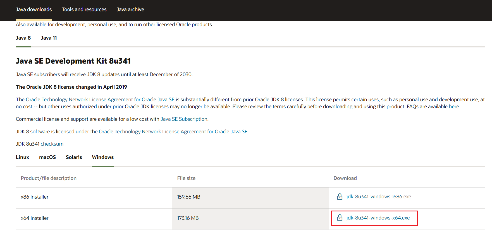

## 2. JDK 安装

- 双击下载好的 `exe` 文件，进入安装程序

- 进入安装向导，点击下一步

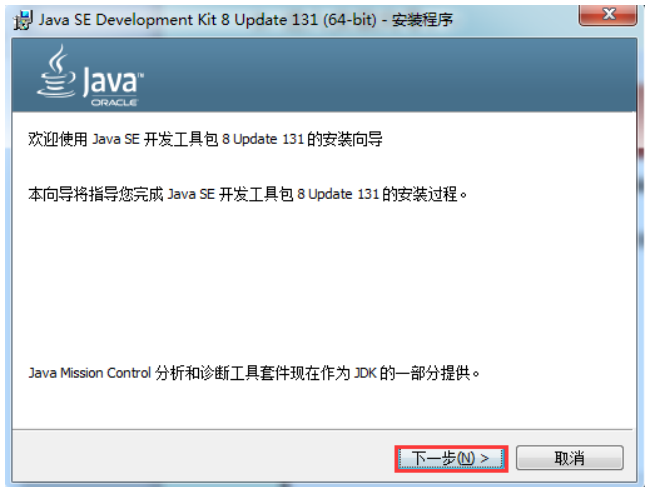

- 更改安装路径，选择安装所有组件，点击下一步

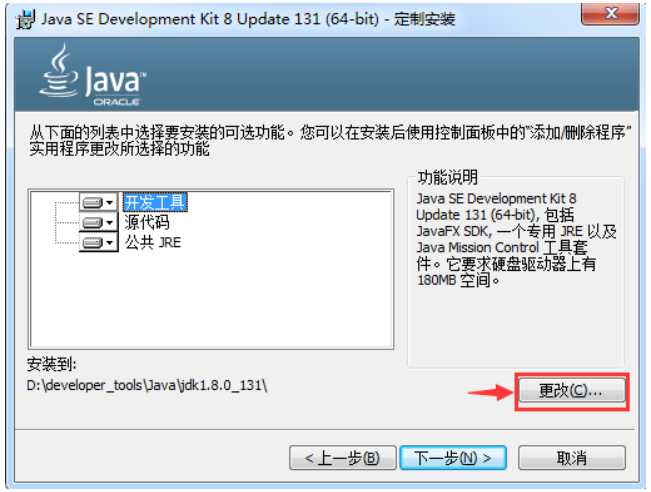

- 开始安装

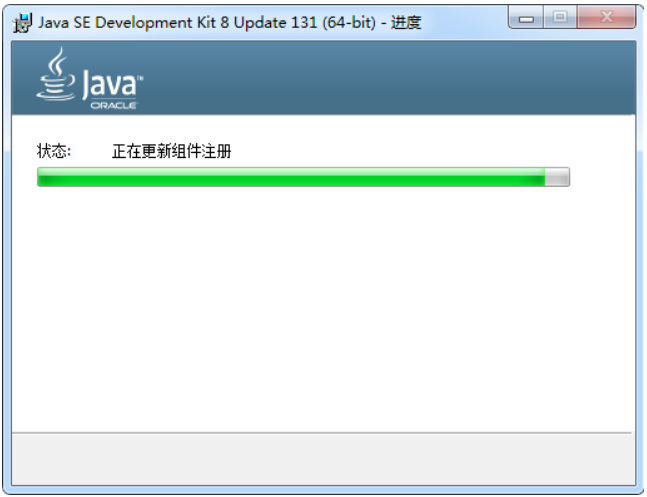

- 安装 `jre`，可以更改 `jre` 安装路径（过程同上述安装的选择）

> 注意：如果提示需要将 `jre` 安装在一个空目录下，用自己创建一个目录即可

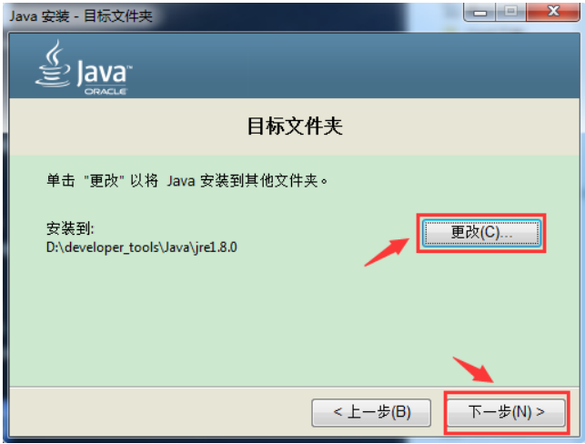

- 点击下一步，开始安装

- 结束安装

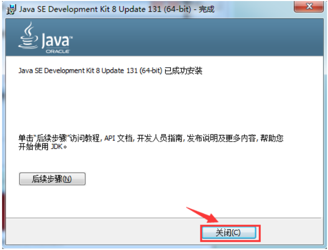

## 3. JDK 配置

- 【win 10 系统】右键桌面 `此电脑` - `属性` - 打开关于页面下的 `高级系统设置`

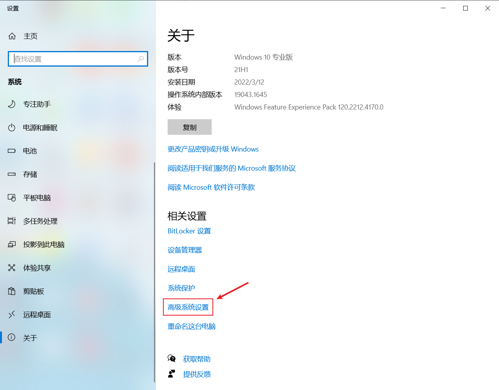

- 点击 `环境变量`

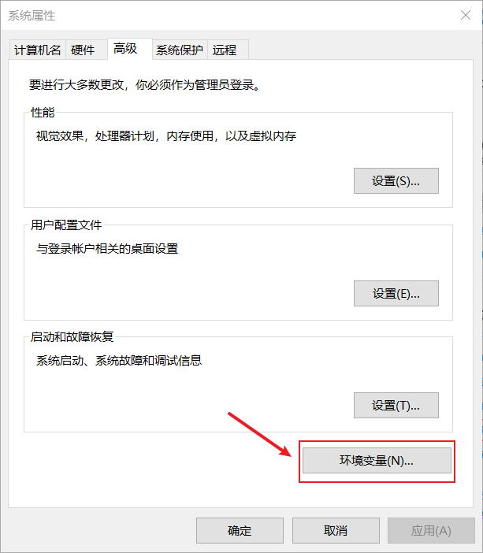

- 新建一项系统变量 `JAVA_HOME`，值为 `JDK` 的安装路径

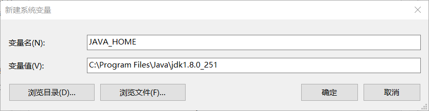

- 配置系统变量：双击系统变量的 `Path`，新建添加一行内容为 `%JAVA_HOME%\bin`，之后一路确定回去

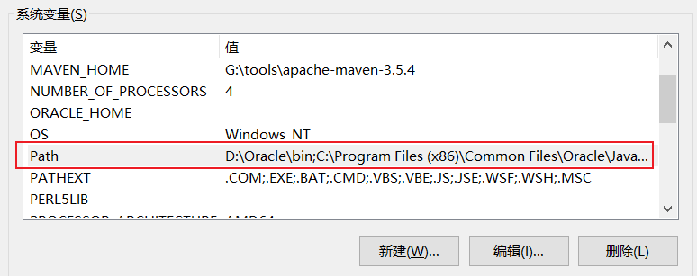

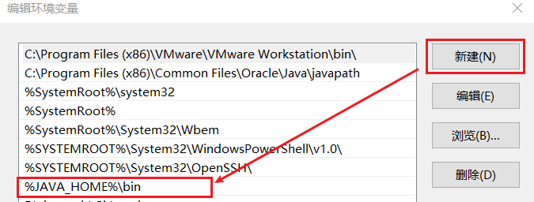

- 查看是否配置成功，`win + r` 打开运行窗口，输入 `cmd`，进入命令行

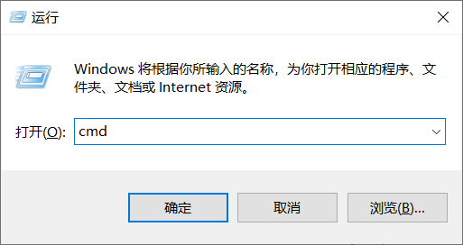

输入 `java -version` 查看 `JDK` 版本，出现如下信息说明配置成功

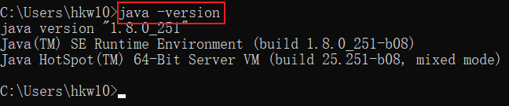