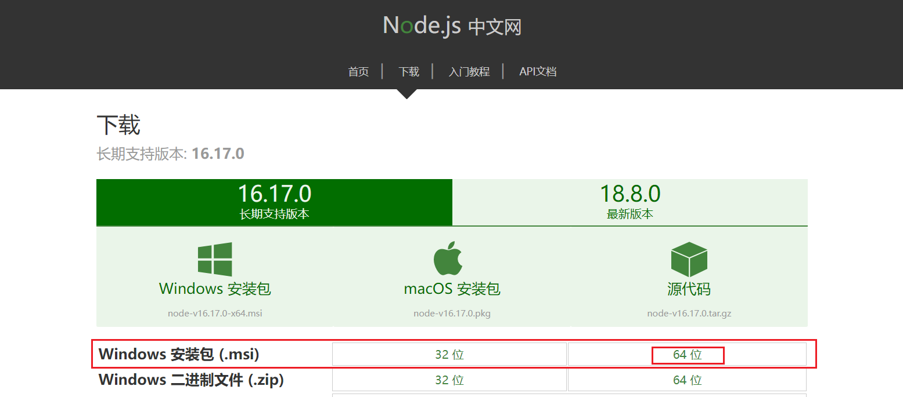
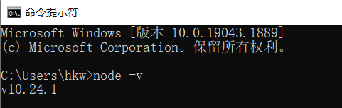

## 1. Node.js 简介

- `Node.js` 是一个基于 `Chrome V8` 引擎的 `JavaScript` 运行环境
- 可以简单地将 `Node.js` 类比理解为 `Java` 项目的依赖管理工具 `Maven`

## 2. Node.js 下载

下载地址：[下载 | Node.js 中文网 (nodejs.cn)](http://nodejs.cn/download/)



我们只需要关注 `npm` 的功能就行了，`npm` 是随同 `node.js` 一起安装的**包管理**工具

## 3. Node.js 安装

【安装步骤不赘述，无脑下一步即可😄】

使用 `node -v` 检查版本



## 4. Node.js 配置

- 配置 `npm` 使用淘宝镜像

```shell
npm config set registry http://registry.npm.taobao.org/
```

