## 1. PLSQL 下载

- 链接：https://pan.baidu.com/s/1_hV6jVV4oBus0C19EgLMYQ?pwd=tdpp 
- 提取码：tdpp 

## 2. InstantClient 下载

- 链接：https://pan.baidu.com/s/1j6q0tuD7g1T6seX9U6IK0A?pwd=qdrb 
- 提取码：qdrb 

## 3. PLSQL 安装

- 双击 msi 文件，按照提示安装，选择默认选项即可【这里不再赘述】
- 使用下载下来的注册码文件进行注册激活，具体操作如下图：

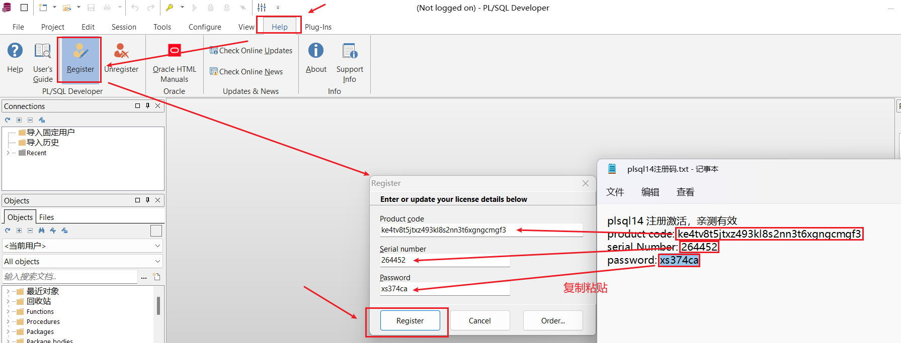

出现如下提示框说明注册成功！

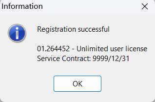

## 4. InstantClient 配置

解压 instantclient 压缩包，打开 `network -> admin -> tnsnames.ora` 文件

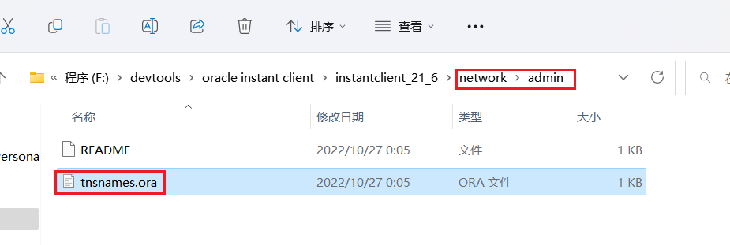

编辑 tnsnames.ora 文件，添加自己预先想要设定的数据库连接配置，举例如下：

```ora
kfdb212 =
  (DESCRIPTION =
    (ADDRESS = (PROTOCOL = TCP)(HOST = 192.168.201.212)(PORT = 1521))
    (CONNECT_DATA =
      (SERVER = DEDICATED)
      (SERVICE_NAME = kfdbpdb)
    )
  )
```

添加好配置后，还需要在 PLSQL 中对 IntantClient 进行配置【配置 Oracle 主目录和 OCI 库，后面会讲到】，后续打开 PLSQL 时就无需每次输入数据库连接信息，只需输入密码即可（首次需要输入用户名）

## 5. PLSQL 配置

> 首先打开 `Configure -> Preferences` 首选项界面
>
> 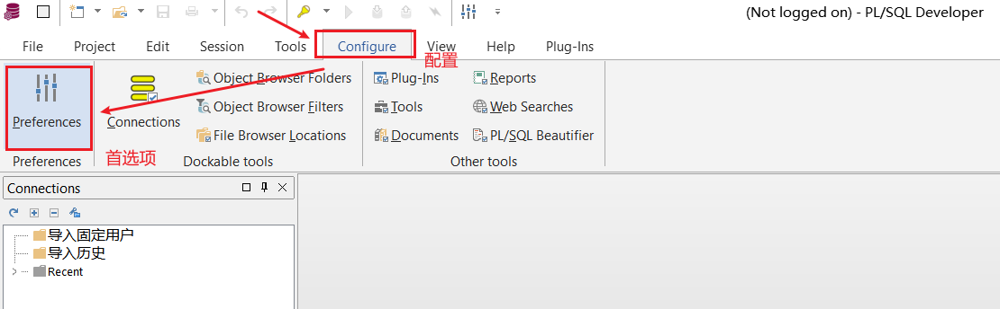

- **配置语言为中文**

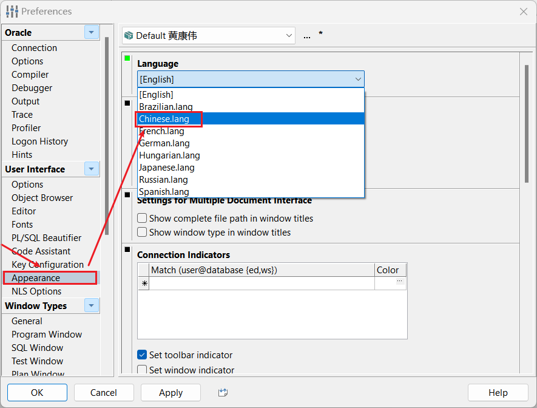

点击 `Apply` 然后点击 `OK`，配置成功后界面变为中文语言

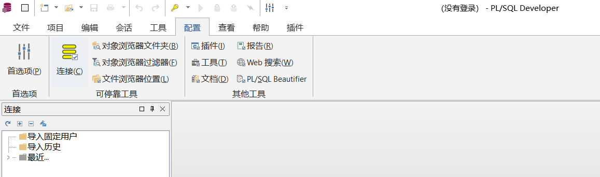

- **配置 Oracle 主目录 和 OCI 库**

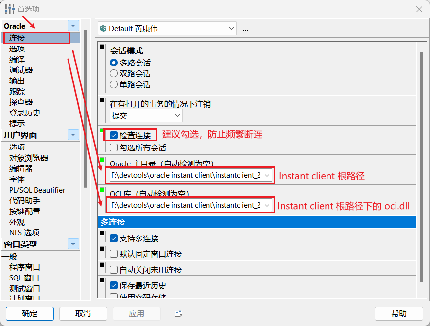

## 6. 字符集环境变量配置

为防止出现字符集乱码问题，在正式使用 PLSQL 之前，我们需要进行字符集环境变量的配置

打开系统 `环境变量` 配置界面，在 `系统变量` 中 `新建` 一个变量，取名 `NLS_LANG`，值为 `SIMPLIFIED CHINESE_CHINA.AL32UTF8`

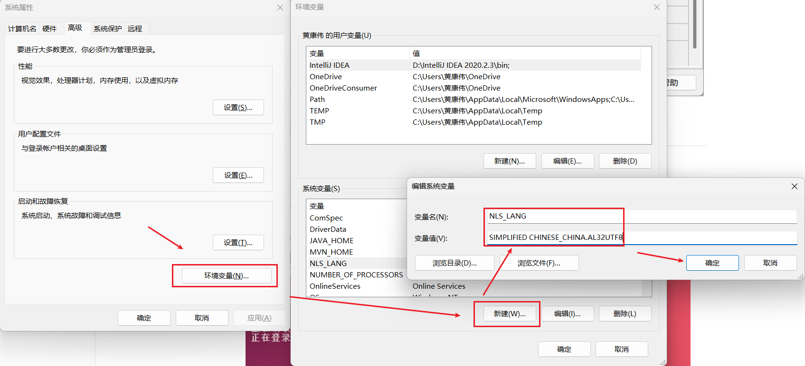

## 7. PLSQL 使用

### 登录

在 Oracle 登录界面，输入正确的 `用户名` 和 `密码` 后，点击确定

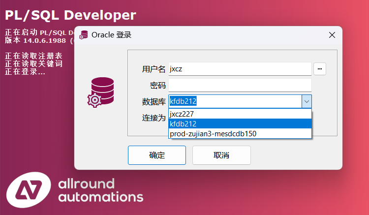

### 查看表

在左下角的 `对象` 窗口中找到一个名为 `Tables` 的文件夹，展开这个文件夹就能够看到当前数据库下的所有表

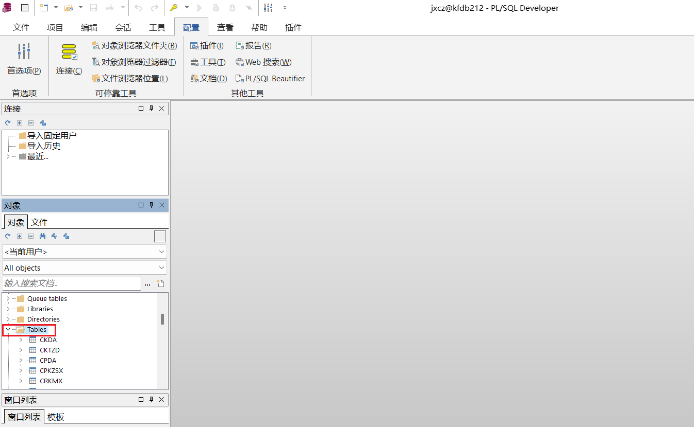

### 执行 SQL

新建一个 SQL 窗口：`文件` -> `新建(N)` -> `SQL 窗口(S)`

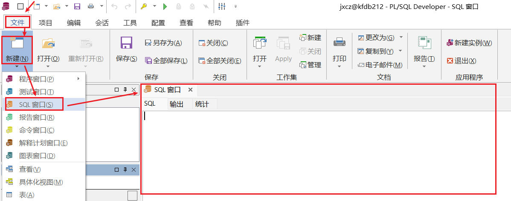

键入需要执行的 SQL 语句，点击最上方一行的绿色按钮执行 SQL 语句【或者使用快捷键 `f8`】

> 默认是执行窗口中的所有语句，如果在窗口中编写了多条语句，但是只想执行其中的部分语句，只需要先选中想要执行的语句，然后执行即可【存在多条 SQL 语句时，记得每条语句结尾写 ;】

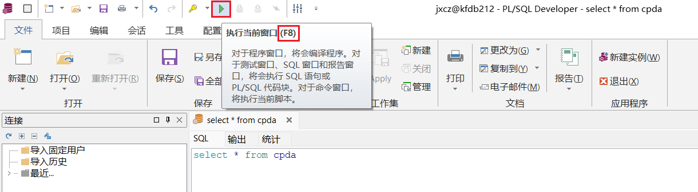

查询结果在超过一定行数时会默认分页显示，点击如下图中的绿色按钮，可以展示所有数据

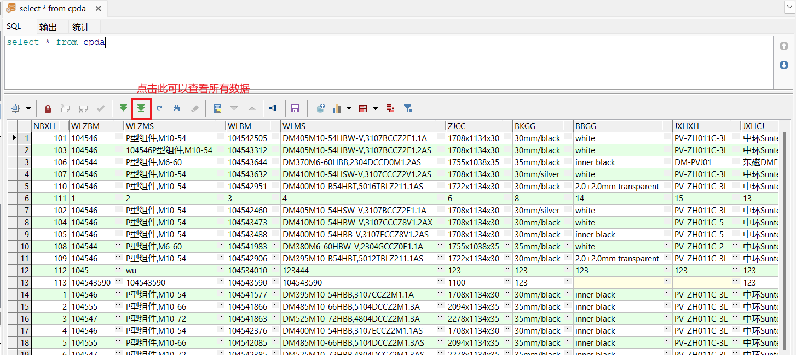

### 创建序列

> Oracle 的主键递增需要依赖序列，所以我们需要掌握序列的创建
>
> **创建序列有两种方式：SQL 语句创建、PLSQL 可视化界面创建**

SQL 语句创建模板如下：

```sql
CREATE SEQUENCE SEQUENCE_NAME
 MINVALUE 1 --最小值
 NOMAXVALUE --不设置最大值
 START WITH 1 --从1开始计数
 INCREMENT BY 1 --每次加1
 NOCYCLE --一直累加，不循环
 NOCACHE; --不建缓冲区
```

PLSQL 可视化界面创建：`文件` -> `新建(N)` -> `序列(Q)`

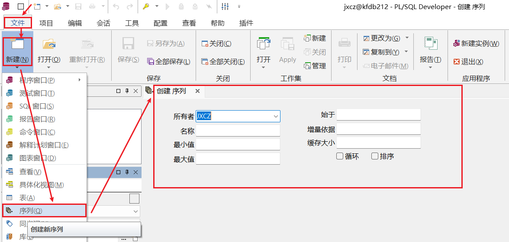

### 提交事务

有时候我们需要对数据库表进行锁表更新，可以通过在查询 SQL 语句后边跟一个 `for update` 来完成，编辑之前需要点击红色小锁按钮进行解锁【锁图案会变成另一个打开状态的绿色小锁】，编辑完数据后再点击进行上锁，然后点击最上面一行【执行按钮右侧的两个】的两个按钮，左边绿色的是提交事务按钮，右边红色的是回滚事务按钮

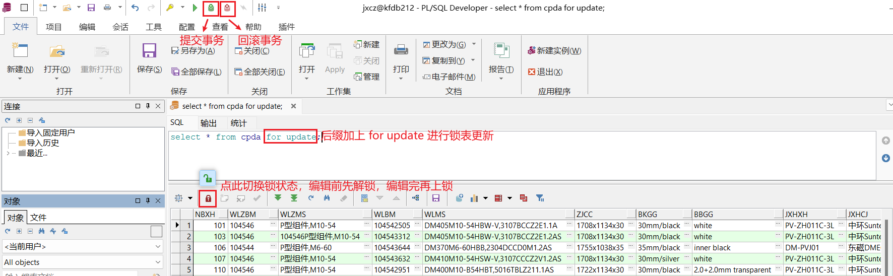

