## 1. PowerDesigner 下载

- 链接：[https://pan.baidu.com/s/17ZGJ6EVT-3U3Dq4nMzjjtg?pwd=ez9l](https://pan.baidu.com/s/17ZGJ6EVT-3U3Dq4nMzjjtg?pwd=ez9l)
- 提取码：ez9l 

## 2. PowerDesigner 安装

- 按照提示安装，选择地区时选择 `Hong Kong`，其他使用默认选项即可【这里不再赘述】
- 进行 powerdesigner 破解，将下载下来的 `pdflm 16.dll` 文件复制粘贴到 powerdesigner 安装的根目录进行替换，具体操作如下图：

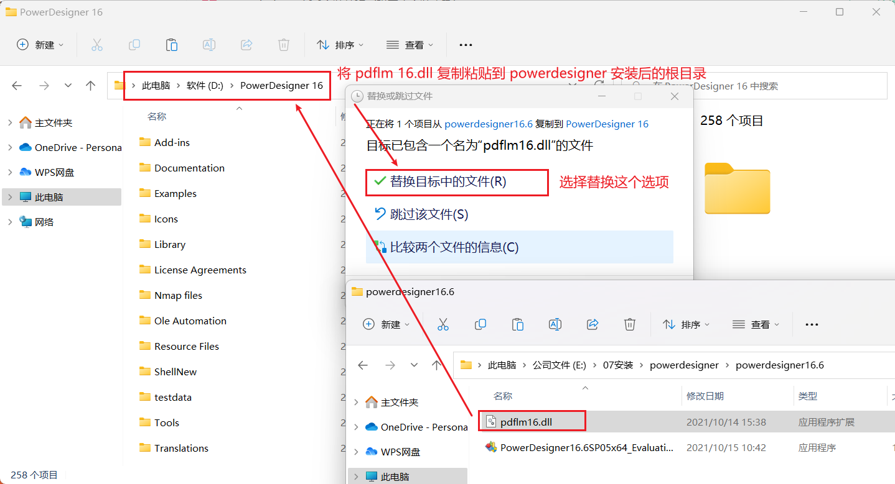

## 3. PowerDesigner 配置

### 文本格式字符集配置

> 此项配置是为了防止导出 SQL 脚本运行时出现乱码问题

打开：`Database` -> `Generate Database` -> `Format`，将 `Text formatting` 下的 `Encoding` 设置为 `UTF-8`

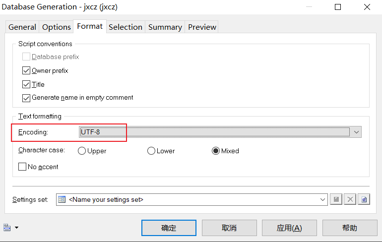

### SQL 脚本去掉双引号

> 此项配置是为了查询数据库表时不区分大小写【表名、字段】

打开：`Database` -> `Edit Currnet DBMS ...` -> `General`，具体操作如下图：

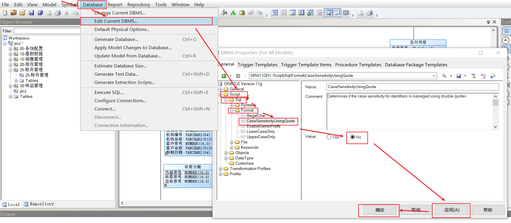

## 4. PowerDesigner 使用

> 如下操作都是在已有 pdm 文件前提下，从 0 到 1 创建工作区和物理模型等这里暂不赘述

### 新建表

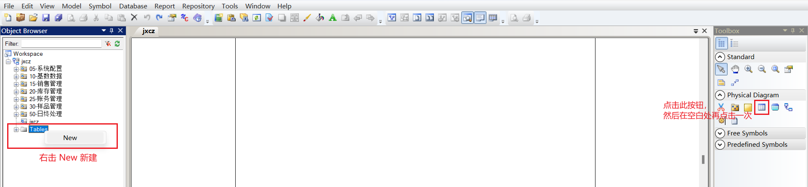

### 编辑表

**General：表信息**

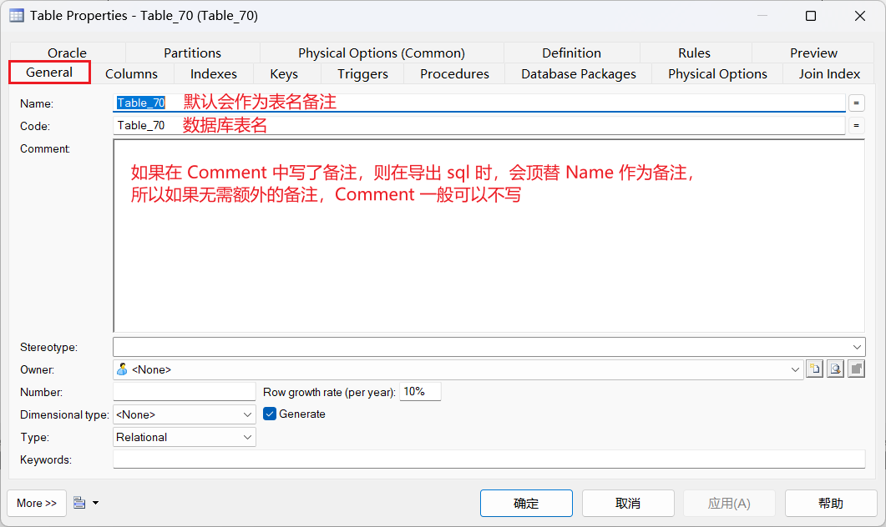

**Columns：字段信息**

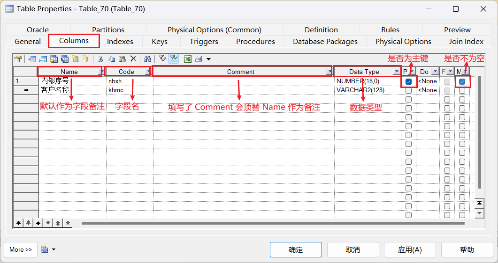

`Comment` 默认不展示，打开它的步骤如下图：

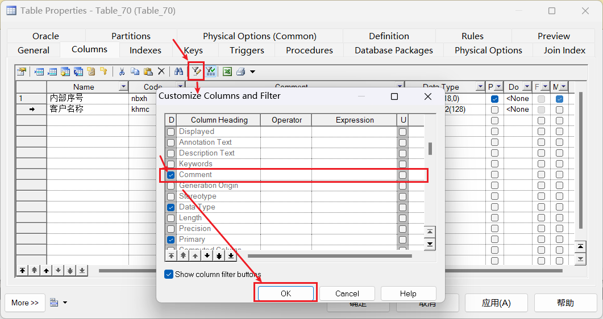

### 预览 SQL

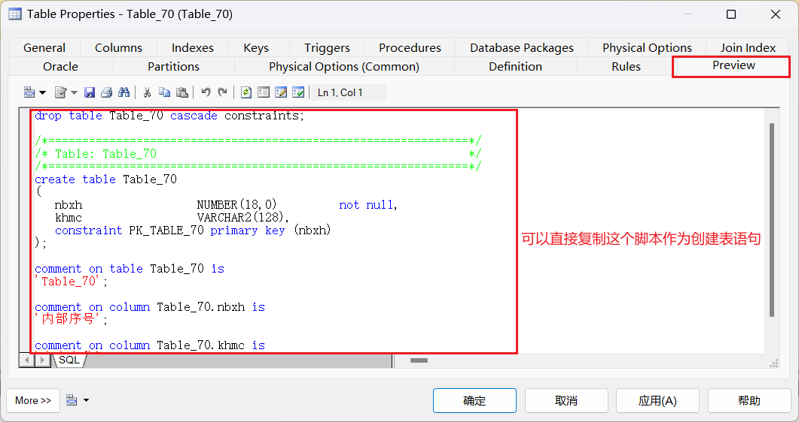

### 创建索引

这里以创建客户名称的唯一索引为例，具体操作如下图：

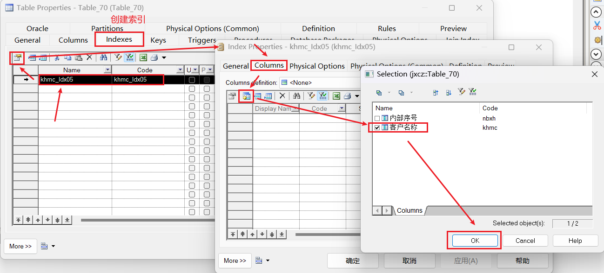

## 5. PowerDesigner 连接数据库

> 以下操作以连接 进销存账 powerdb 数据库为例

打开数据库连接界面

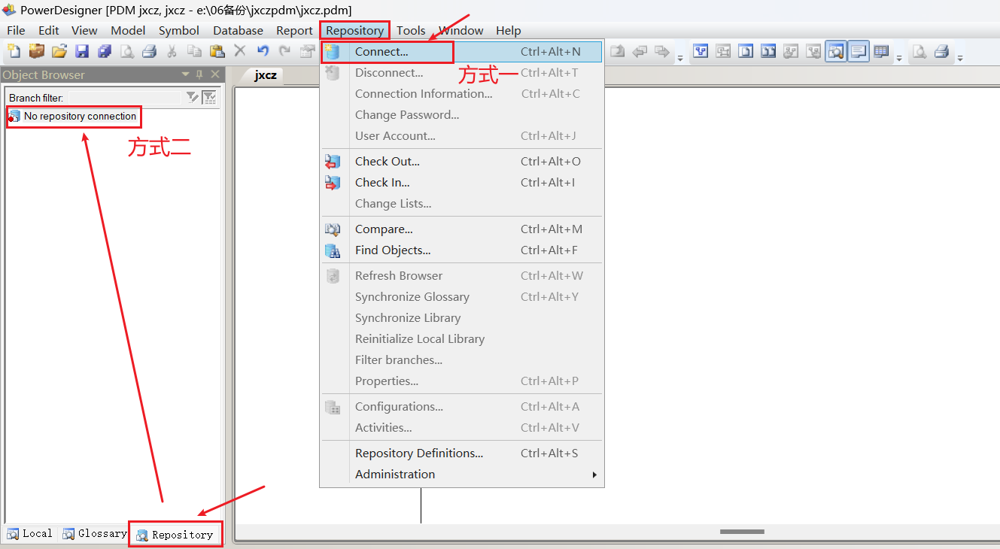

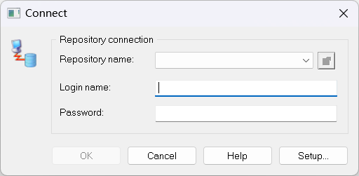

点击 `Setup ...`，按下图进行操作：

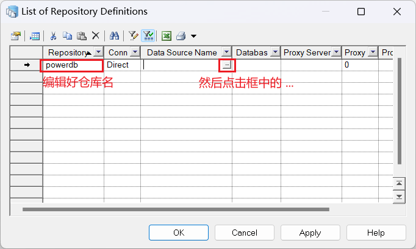

选择 `Connention profile`（前提是有 dcp 文件，没有就自行输入连接信息），按下图进行操作：

> 下边的 ojdbc8 jar 包需要提前准备

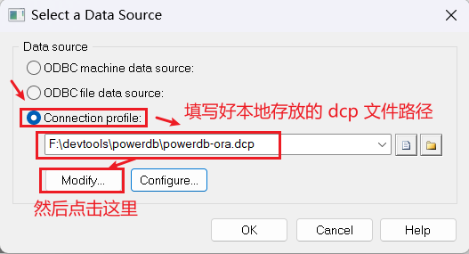

填写数据库连接定义信息，按下图进行操作：

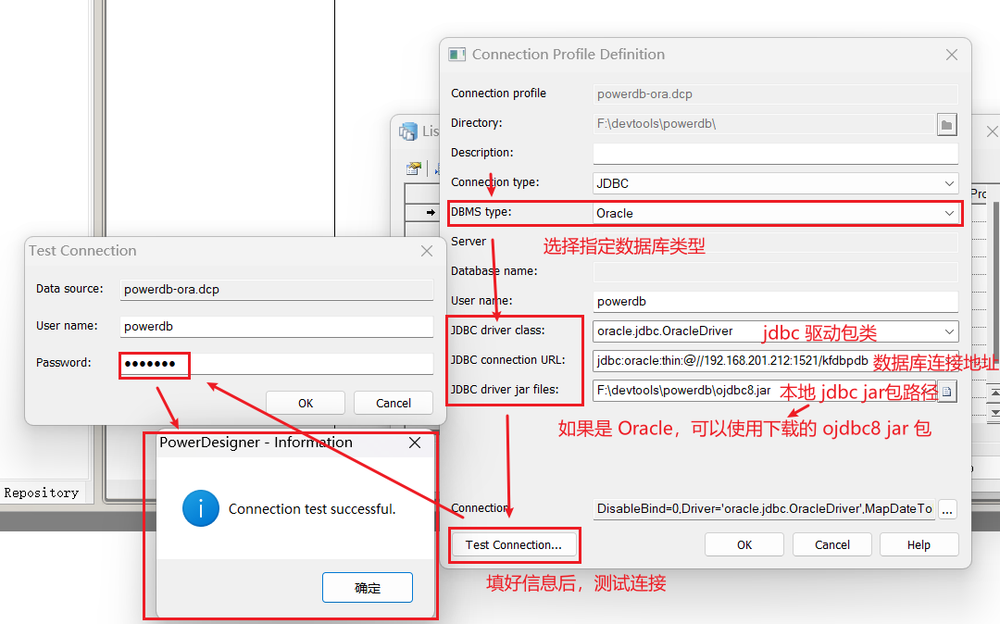

测试连接成功后，点击三次 `OK` 到 `Connect` 界面，按下图进行操作：

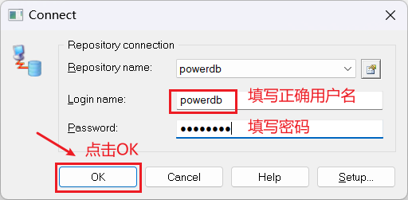

在下一个界面输入正确的密码后，点击 `Connect` 开始连接

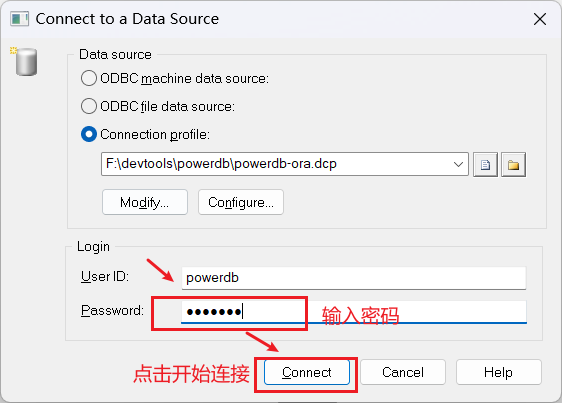

连接成功后在底部的 `Output` 控制台会输出如下信息

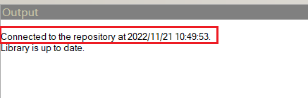

连接成功后可以在 `Repository` tab 页下看到当前的版本信息

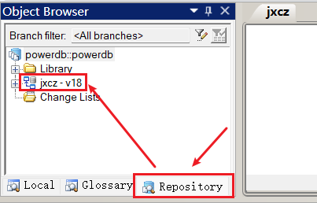

## 6. PowerDesigner 拉取与提交

### 拉取

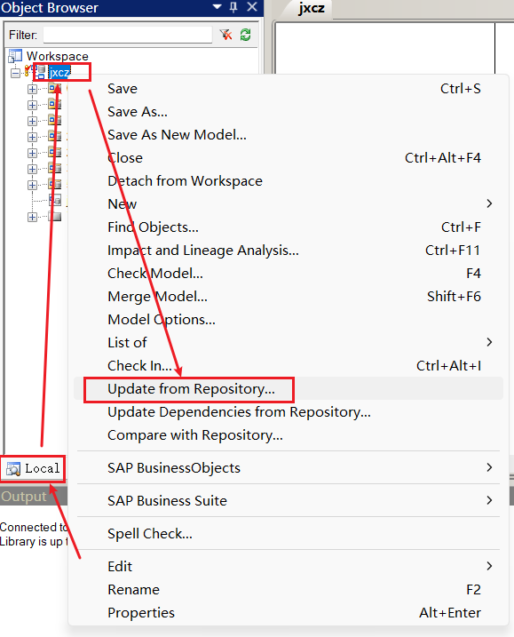

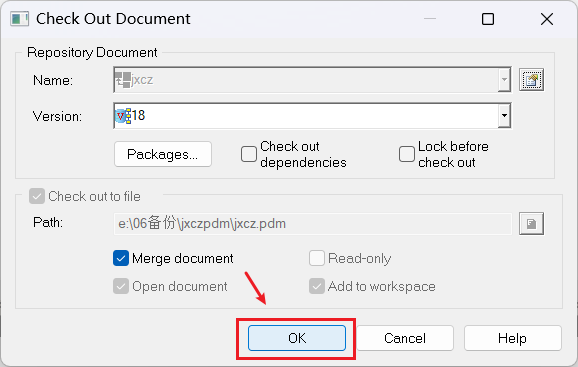

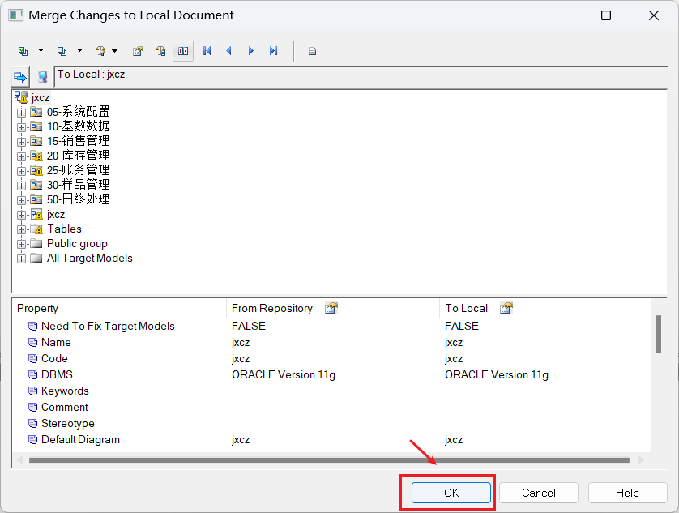

拉取成功 `Output` 控制台会输出如下信息

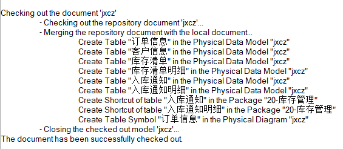

### 提交

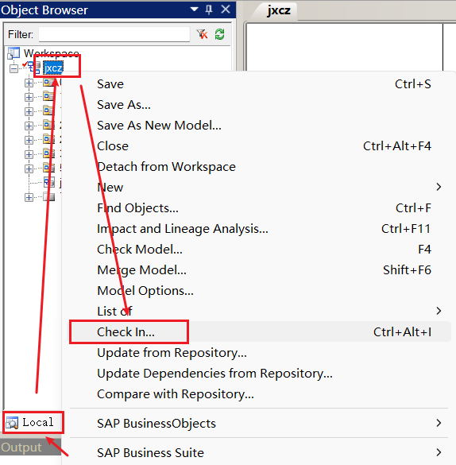

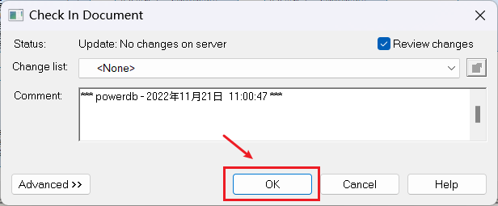

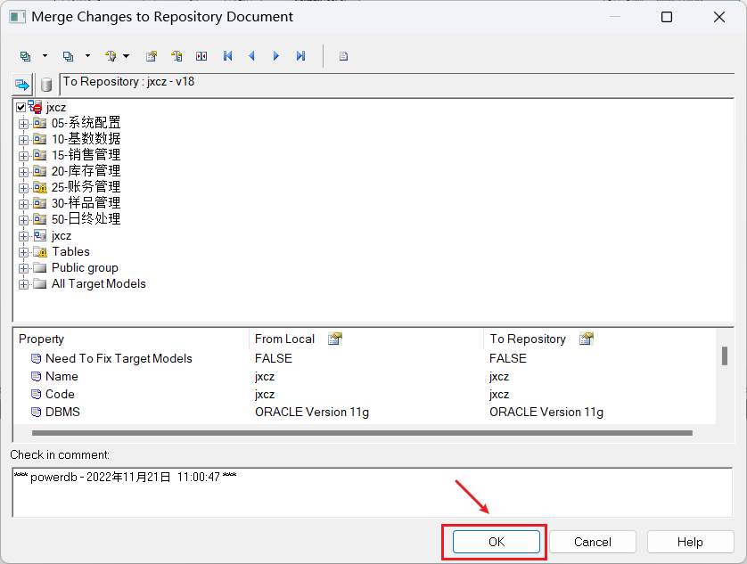

提交成功 `Output` 控制台会输出如下信息

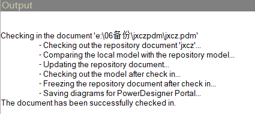

版本号也会随之 +1

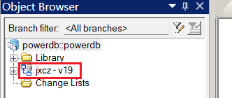